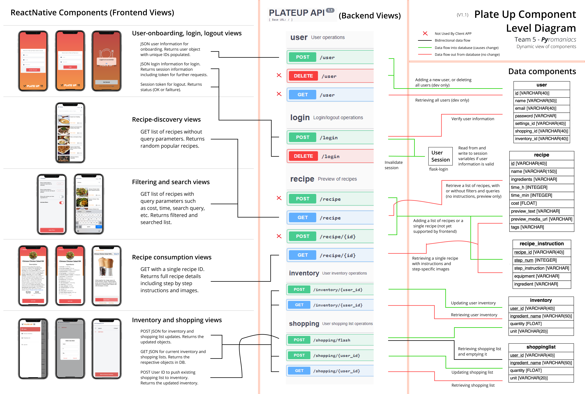
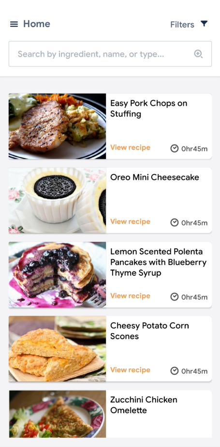
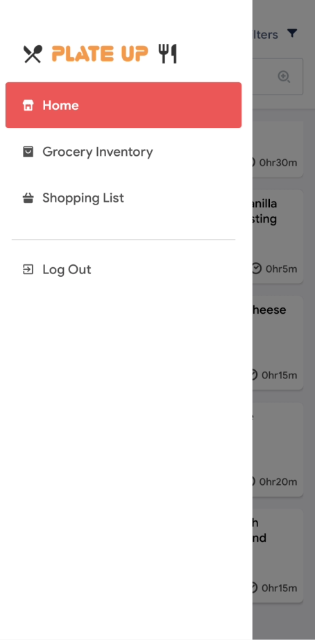
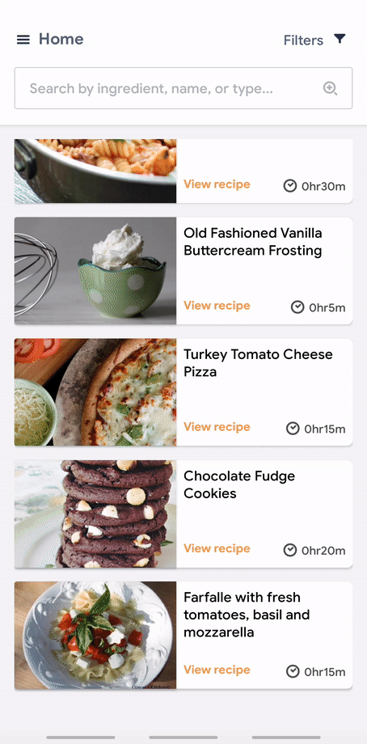
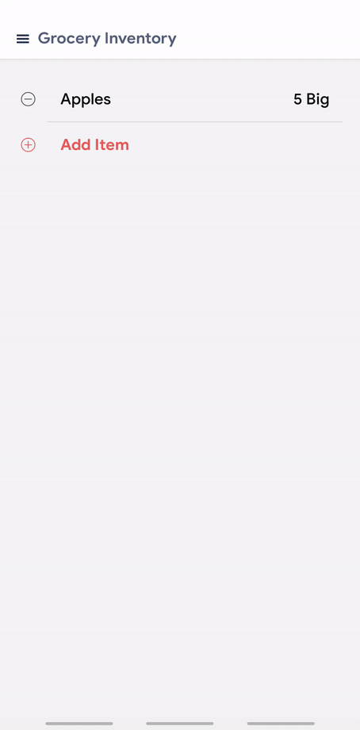

# Plate Up

This repository contains the source code for Group 5 - Pyromaniacs' variant of Chef's Co-Pilot. This application allows users to browse new recipes and be provided with the necessary information to be able to recreate these recipes.

The application follows a client-server model. The client is written in React Native as a mobile application and is found in `./PlateUp-reactnative`. The server is written as a Python Flask web application. The Python Flask web application is separated as a GitHub submodule found in `./PlateUp-flask`. The reason for maintaining a separate submodule for the flask app is for easier deployment to Heroku for staging, as well as better client-server segregation. The group initially had both modules together, hence the issues/tasks are tracked here, but decided to split the module just before beta release. The group will hence forth develop under this layout. 

## Distribution

The client application is distributed through Expo and is availiable as a mobile application at https://expo.io/@pyromaniacs/projects/plate-up-uoft-ece444. The server powering the client is availiable at https://sheltered-thicket-73220.herokuapp.com/. See PlateUp-flask submodule for more details on the server application.

## Architecture
#### Static module layout diagram

<p align="center">
    
</p>

#### Dynamic data flow component diagram

<p align="center">
    
</p>

## Application Features

This section outlines the current features implemented for the application.

### Account Management

The application fully supports login and registration. An account must be created for a user to gain access to the application. Users can navigate to the registration page by clicking "Get Started" on the Onboarding screen. Users with an existing account click "Login" to directly go to the login page. By registering an account, users will automatically be sent a Welcome email.

Privacy Policy:

> There is no privacy for your data in this beta application. We will do our best to safeguard your data and follow security practices (we never store/get access to your password, all passwords are salted and hashed), but consider any information you input public information. We will also have the right to send you a welcome email after you sign up!

### Browse Recipes

Users can browse a maximum of 20 recipes at a time. The recipes shown on initial load are a random selection and not an indication of a small recipe database. At this point in time, pagination is not supported.

<p align="center">
    
</p>

#### Search Functionality

Users can narrow down specific recipes using the search bar at the top. The search functionality is a unified search of (1) ingredient search, (2) recipe name search, (3) tags search. At this time, only single ingredient search is supported.

<p align="center">
    
</p>

#### Filter Selection

Users can further narrow down their searchs by applying specific filters. The current supported filters are: (1) Filter by cost, (2) Filter by cooking time, (3) Filter by grocery inventory.

<p align="center">
    
</p>

### Recipe Details

Users can click specific recipes from the browsing page to get more details on the recipe. Through a horizontal slider, users can see the description of the recipe, the ingredients required, and a list of instructions for that recipe.

<p align="center">
    
</p>

#### Step-By-Step Instructions

Users can press the "Let's Go" button to start the cooking process and have steps prompted to them while they cook. At this time, data on cooking times for each step is missing. Each step currently has a default time of 10 seconds to showcase the feature. Users can pause (and resume) a given step to work at their own pace. For each step, images for required equipment + ingredients is shown as a slideshow.

<p align="center">
    
</p>

### Account Personalization

Through the Drawer Navigation, users can navigate to their personalized grocery inventory and shopping list.

<p align="center">
    
</p>

#### Grocery Inventory

A list users can use to reflect what groceries they currently own. The grocery inventory directly interacts with the "Filter by grocery inventory".

<p align="center">
    
</p>

#### Shopping List

A list users can use to reflect what ingredients they need to buy on their next shopping trip. Once users buy their entire list, they can use the "Move to Grocery Inventory" functionality to move all items to their grocery inventory.

<p align="center">
    
</p>

### Future Improvements

1. Step-By-Step Instructions - Populate real cooking time data and add a numeric timer
2. Shopping List / Grocery Inventory - Support automatic unit conversions
3. Currently, the grocery inventory is mostly manually updated (other than the shopping list flush). The API already supports an endpoint that allows users to "check" whether they meet a recipe's ingredients requirements. If the user meets the ingredients, ingredients will automatically be deducted from their grocery inventory. If the user does not meet the ingredients, missing ingredients will be added to their shopping list. The mobile application does not support this feature at the moment and this can be an improvement for the next release.
4. Search bar improvements - Support multiple ingredients search, currently it is limited by one ingredient at a time
5. Browse recipes - Add pagination support so that a user can browse more than 20 recipes at a time

## Development

### Respository Structure

This repo has two main components: (1) Client Application (2) Server Application.

Client Application - written in React Native using Argon React Native Template, source code in `PlateUp-reactnative`. <br><br>
Server Application - written in Python using Flask, source code in `PlateUp-flask` submodule.

### Local Development

To build and start the system, first clone the repository <br>
`git clone https://github.com/ECE444-2020Fall/project1-plateup-group5-pyromaniacs && cd project1-plateup-group5-pyromaniacs`<br><br>

Development Requirements:

1. Docker - Find installation instructions at https://docs.docker.com/get-started/ <br>
2. Mobile Development - Android/iOS Emulator required locally

#### Server Application

Running the server application is fairly simple with Docker.

`cd PlateUp-flask && docker-compose up`

#### Client Application

Navigate to `./PlateUp-reactnative`.

Install all package dependencies using `npm install`.

**_Without Backend Server Running_**

There is an option to run the application using stubbed data. We use MirageJS to make this possible. See `mock-http.js` to see what HTTP requests are stubbed out. You may need to add additional ones. To use stubbed data, see `App.js` and set the boolean `mockData` to `true`.

**_With Backend Server Running_**

For the react-native application to be able to talk to the backend, you must configure the environment variable SERVER_URL. See the next section for configuring environment variables.

**_Client Environment Variables_**

Environmental variables used in the project must be defined within an `env.js` file in the root directory for the React
Native portion of the application. This file is not included in the repository, as developers are expected to have their
own local version. The format is as follows:

```
const env = {
    SERVER_URL: "insert_url_here";
}

export default env;
```

- SERVER_URL: This is the url to the Flask server that the frontend will use to send requests to. If running the application
  over LAN, use the public IPv4 address of the computer running the server, followed by :5000 for the port. E.g.
  SERVER_URL: "http://192.168.0.18:5000";

**_Starting React Native Application_**

Run `npm start` and connect to your specific emulator through expo localhost interface.
